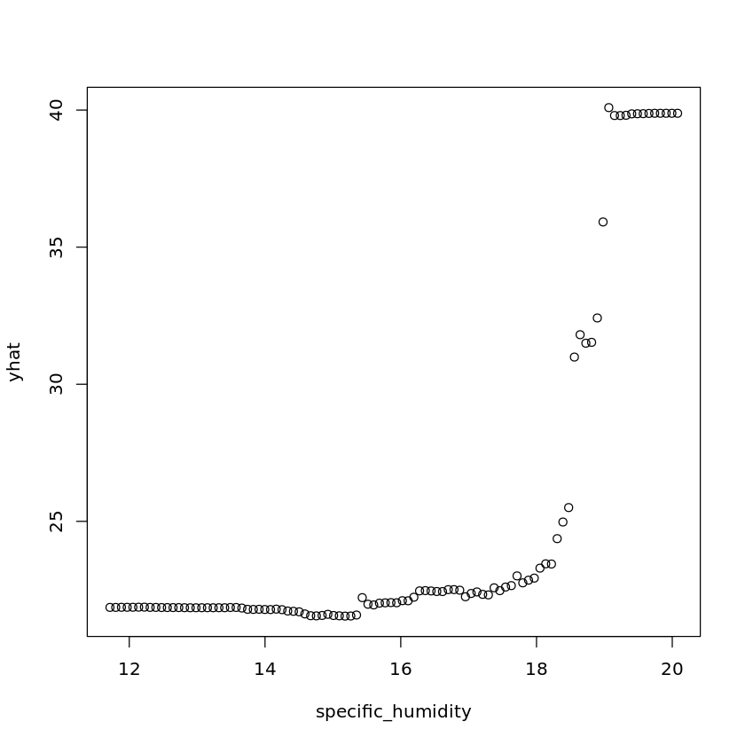
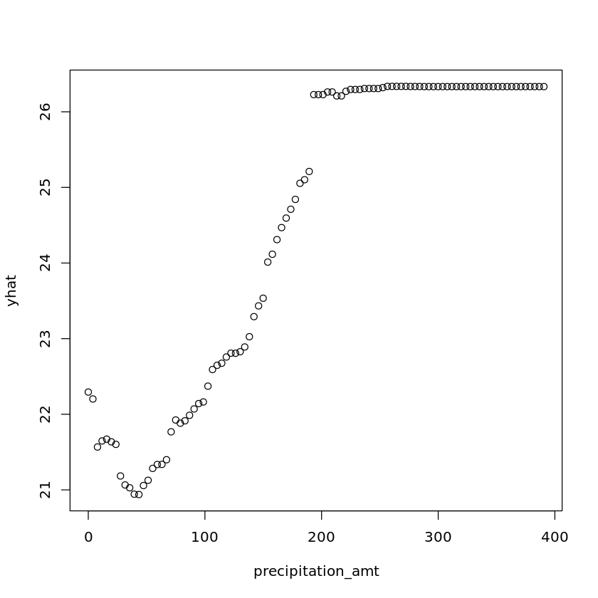
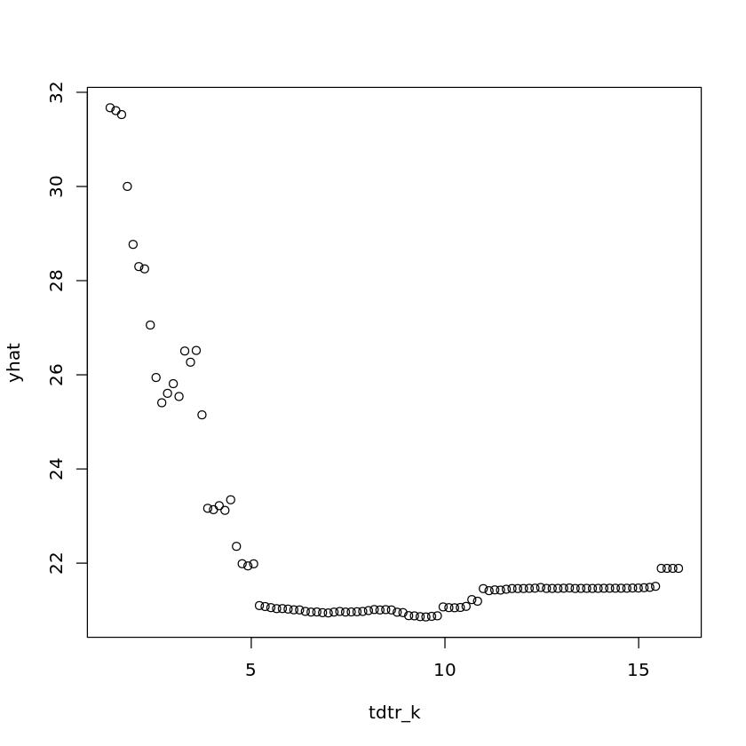
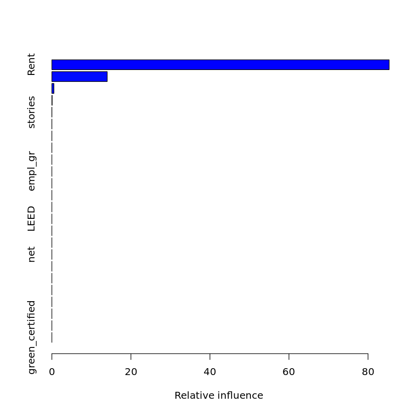
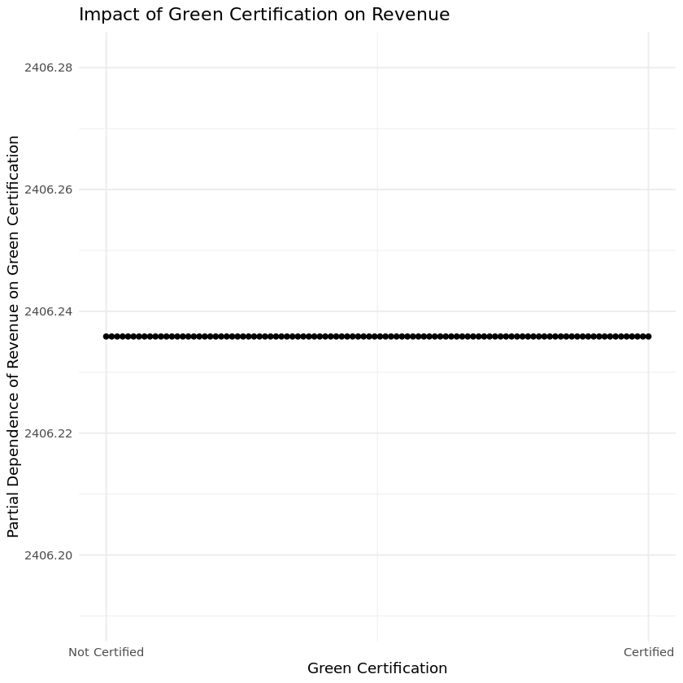
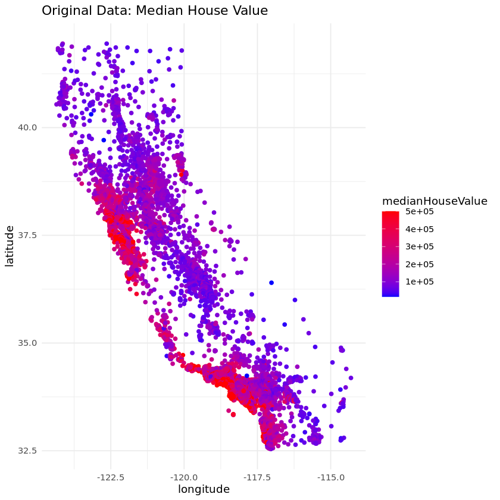
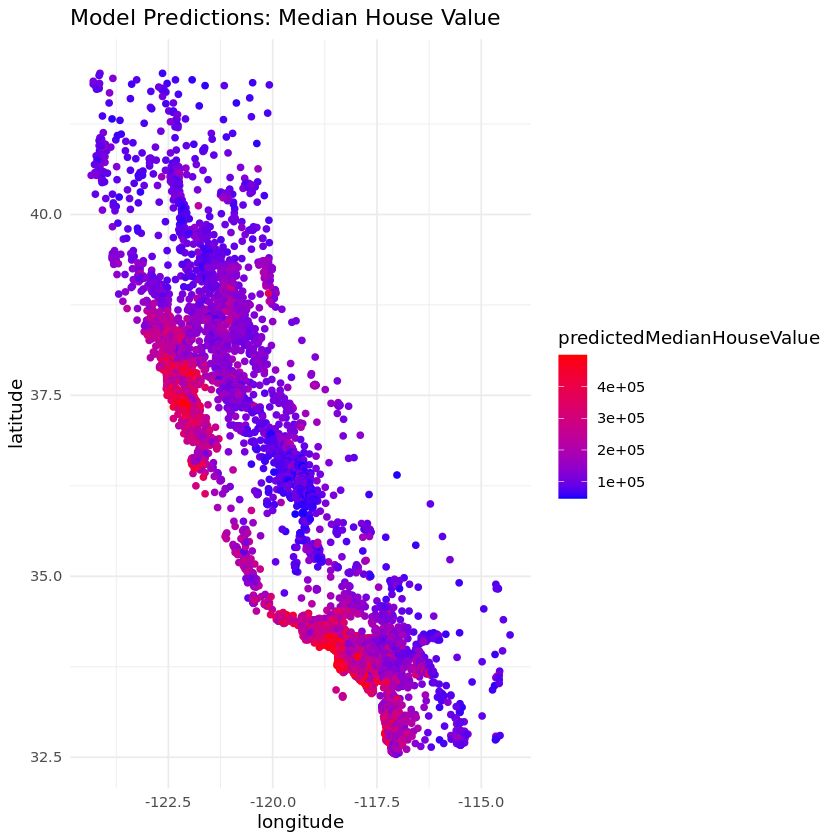
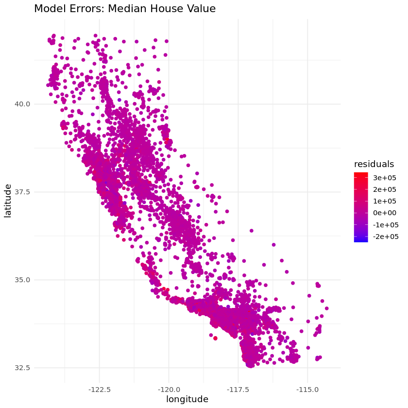
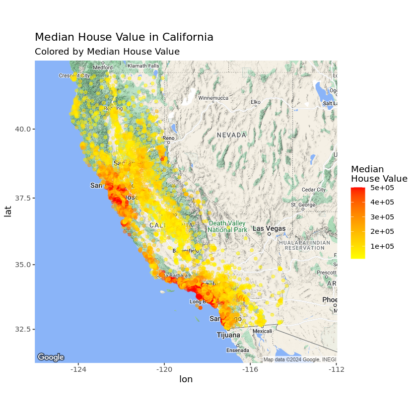

ECO 395M: Exercises 3

What causes what?

1. The most reasonable answer is that the  data is really messy for high crime cities usually have incentive to hire lot of cops.

2. Their approach is that use terrorism alert system to find a way putting extra cops unrelated with street crime. We could see from the table 2 that on high-alert days total daily crime decreases which means there could be casual effect between high cops and low crime. But there is still question about whether the result is because effect of high level terrorism alert. High level terrorism alert could decrease people flows then also reduce crime. Thus they check and control the METRO ridership in order to prove that high level alert has no effect on crime decrease. The result is still significant.  

3. Control for Metro ridership could exclude the effect of different people flows to crime. For example, lower Metro ridership means people prefer to stay at home thus criminals would also not hang out. Under the same METRO ridership would clearly display the casual effect between cops and crime.

4.  The model estimated here is the effect of high alert to crime reduction with dummy variable controlling for district one and the other districts. The conclusion is that the reduction of daily total number of crimes in district 1 would decrease more heavily than the other districts given midday ridership. To make interpretation, I think the reason is that people would not choose to visit National Mall during high high alert days thus even the metro ridership is controlled, district one would still have less people flows in those days.

Tree modeling: dengue cases

    [1] "CART RMSE: 28.9027540550304"
    [1] "Random Forest RMSE: 26.89955128771"
    [1] "GBM RMSE: 28.0002977099608"

    [1] "The best model due to the minimum RMSE is:"
    [1] "Random Forest"

    

    

    

    

    

    

I use CART, random forests, and gradient-boosted trees to predict dengue cases. Data split percentage is 0.8. The reason that not to use log dengue cases is that I want to capture the direct linear casual effect from all variables to dengue cases. I have simply used all features to build three models and run a function to find the best model, which is random forest model. Then I make three partial dependence plots: specific_humidity, precipitation_amt and tdtr_k.

Predictive model building: green certification

    [1] "CART RMSE: 420.05197895964"
    [1] "Random Forest RMSE: 149.344849251891"
    [1] "GBM RMSE: 102.74511462644"

    

    

    

    

    

    

At first I create two new columns named green_certified and revenue_per_sqft, assuming 'LEED' and 'EnergyStar' are binary. revenue_per_sqft equals to Rent * leasing_rate. Then I have built three models: CART, Random forest and Gradient Boosted Trees. All these three models contain the whole features in dataset. Data split percentage is 0.8. Then I evaluate these three models by RMSE to find the best model, which is GBM according to RMSE. Besides, I have found that size and cluster are more significant than other features showed by feature importannce.
Futhermore, as PDP has displayed, the model suggests that changes in the green certification status, holding other features constant, do not significantly impact the rental income per square foot. 

Predictive model building: California housing

    [1] "RMSE:  56084.7414055478"
    [1] "Random Forest RMSE: 50560.0087690561"
    [1] "CART RMSE: 79284.2782813531"

Original Data: Median House Value

    

    

Model Prediction: Median House Value

    

    

Model Errors: Median House Value

    

    

    ℹ <https://maps.googleapis.com/maps/api/staticmap?center=37,-119&zoom=6&size=640x640&scale=2&maptype=terrain&language=en-EN&key=xxx>
    

    

    

For this part I have built three mmodels containing GBM, CART and random forest model using all features in the dataset in order to contain more information. Thus I find the best model is random forest mmodel. The data split percentage is 0.8.  Then we could gain RMSE from the code as out-of-sample accuracy of proposed model. And we could see from the graphs about the prediction and model error that the model fits well. 
